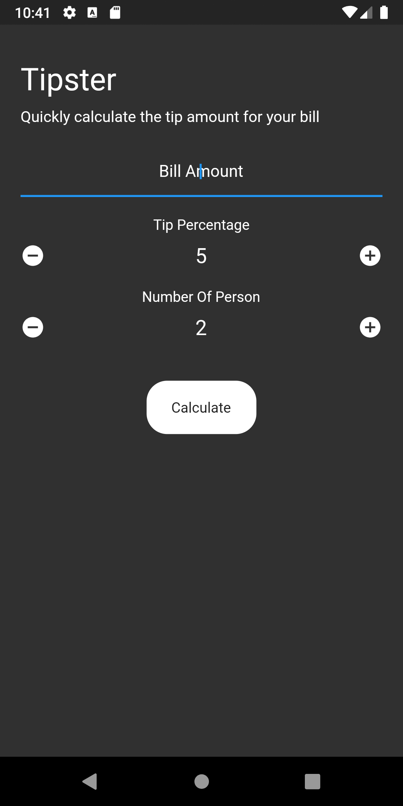
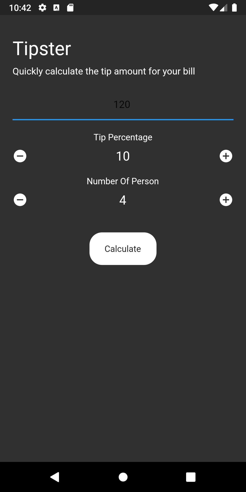
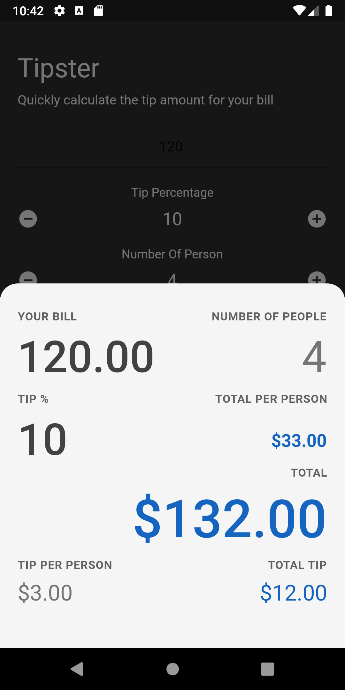

# tipster

 
add the bill amount and set the tip percentage as per your generosity 😅 and set the number of people if you wish to split the bill equally.

hit Calculate

voilà, all the details like total bill , tip per person , total tip , total per person shows up
